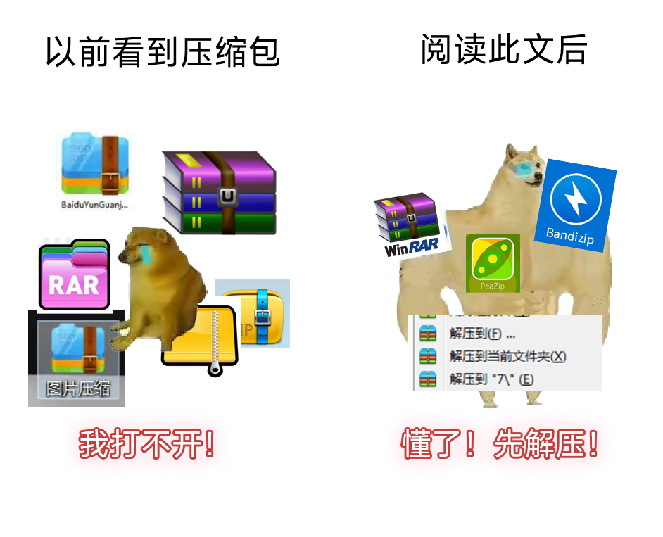
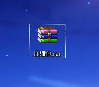
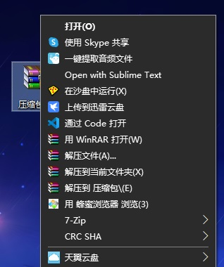
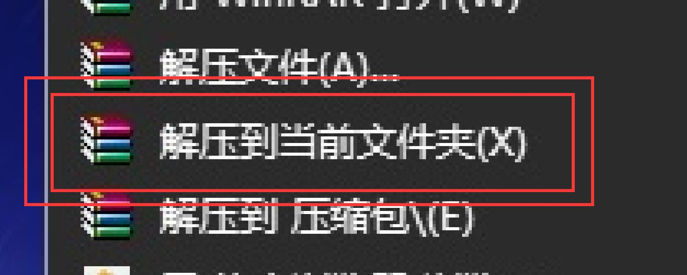

# 简明解压教程

## 一文搞定所有常见打不开的压缩包

## 关键词

压缩包、解压、正确解压、解压方法

## 实验背景

压缩包的解压是计算机基础技能。然而，在互联网上搜索解压教程，会发现他们大多数晦涩难懂，操作复杂。

出于各种不方便的教程和解压压缩包的必要性，此实验将专注于**解压**一个压缩包，专注于**办公实际需求**。

## 实验原理

多个文件**打包**在一起，可以形成**压缩包**。压缩包是一个文件，它**打包**了多个文件。

如果要使用压缩包里面的文件，需要把它解压。

这就像打开**行李箱**一样，**无法在不打开行李箱的情况下拿取里面的物品**。

## 实验材料

如图所示，本次实验需要：

1. 一个压缩包，压缩包内有两个文件（`文档.docx` 和` 图片.jpg`，已被添加进实验用压缩包）
2. 压缩软件（预先安装在电脑上）

## 实验步骤

### 一、准备压缩包，并将其放于桌面。

（如何添加压缩包不在此描述，此实验专注于压缩包的**解压**。这个压缩包有两个文件在内）

## 二、用鼠标右键点击它，会弹出一个菜单：

鼠标右键，也就是位于鼠标右侧的按键，只需用手点击即可。

## 三、点击解压到当前文件夹

注：如果压缩包内文件过多，也可选择“解压到 压缩包”选项。根据压缩包名称的不同，此选项名称不同。

如果压缩包名为 `资料.rar` 那么该选项为 `解压到 资料`。如果压缩包名为 `图片.zip` 那么该选项就叫 `解压到 图片`。 

使用此选项，会在压缩包所在目录旁边生成一个新的文件夹，包含压缩包内的内容.

即，令压缩包名称为 stem，扩展名为 ext，压缩包全名为 stem.ext，那么在这个右键菜单中，会出现三个选项（以实际看到的为准）：

- 解压文件...
- 解压到当前文件夹
- 解压到 stem

### 四、文件解压完成

## 实验结果

成功解压，如图，位于压缩包内部的**两个文件**已被提取

## 扩展资料

- 通常，压缩包**需要解压**才能访问内部文件。
- 如果计算机能够显示完整的文件名，那么压缩包结尾通常是 `.zip` `.rar` `.7z` 字符。
- 压缩包并不是系统默认支持的格式，需要**压缩软件**才能正常工作。有些计算机默认安装了压缩软件，**而有些没有**。
- 尽管 `Windows 操作系统`能打开 `zip`格式的压缩包，但依然推荐安装第三方压缩软件。
- `Linux 操作系统`自带了解压缩软件。
- 常用的良心压缩软件有：`bandizip`、 `peazip`、 `7-zip`。
- 经典老牌压缩软件：`WinRAR`。
- 部分冷门资料的压缩格式为 `.tar.gz`，通常使用命令行解压。

